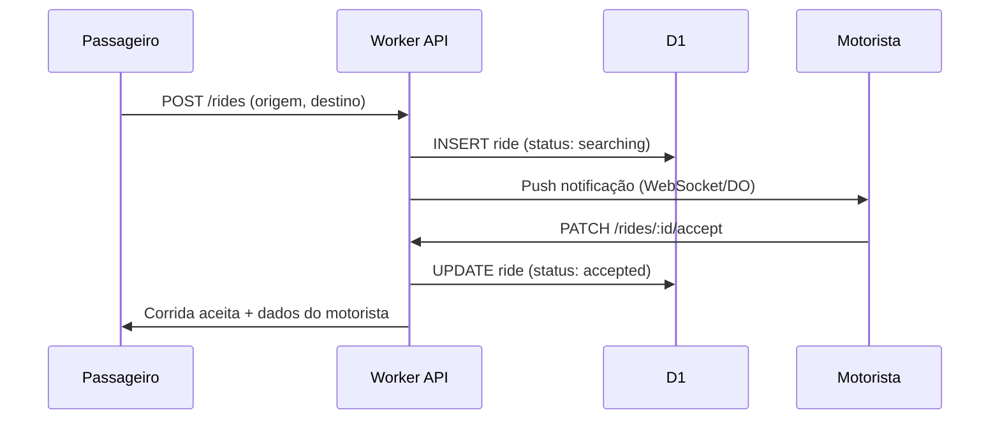

# MotoJá — Escopo da Fase 1

> **Status:** protótipo frontend em produção + **MVP backend Workers + D1** (corrida entre dispositivos)  
> **Última atualização:** agosto/2026

## Visão geral

O **MotoJá** é um aplicativo de mobilidade urbana focado em **Carmo, RJ**, conectando passageiros a mototaxistas locais.

| Fase | Entrega |
|------|---------|
| **Fase 1 (atual)** | Web PWA — protótipo funcional com corridas simuladas |
| **Fase 2** | Publicação na Google Play Store (TWA ou Capacitor) |
| **Fases 3–5** | Backend real, pagamentos, painel admin completo (ver [Roadmap](#roadmap-fases-15)) |

### Demo em produção

O app **MotoJá** está publicado na Cloudflare Pages:

**https://motoja.pages.dev** (oficial)

Link legado (ainda válido): `https://mototaxi.pages.dev`

Apps separados (sem hub de escolha; `/` redireciona para passageiro):

| App | URL |
|-----|-----|
| Passageiro | `/passageiro` |
| Mototaxista | `/motorista` |
| Admin | `/admin` |

Cada rota usa um **manifest PWA** próprio (`MotoJá Passageiro` / `MotoJá Motorista`) para permitir instalar o papel certo.

> ⚠️ **Demonstração / MVP:**
> - Corridas passam pelo **Worker + D1** (não só simulação local).
> - GPS do motorista é persistido no D1; o passageiro vê motoristas online no mapa.
> - Auth completa ainda **não** existe (`device_id` simples).
> - HTTPS ativo (necessário para `navigator.geolocation` e instalação PWA).
> - Sem pagamento real nem painel admin.

---

## Módulos do sistema

### 1. Passageiro (web / PWA — `/passageiro`)

- Solicitar corrida com origem e destino no mapa
- Ver mototaxistas próximos (simulados no protótipo)
- Acompanhar status da corrida (buscando → a caminho → em andamento → concluída)
- Avaliar motorista ao final
- Histórico de corridas
- Instalar como **MotoJá Passageiro**

### 2. Motociclista (web / PWA — `/motorista`)

- Toggle online/offline
- Receber solicitações de corrida com **mapa da origem do passageiro**
- Aceitar ou recusar
- Navegação até o passageiro e destino (pins + rota no mapa)
- GPS real transmitido via API (Workers + D1)
- Ganhos e histórico
- Instalar como **MotoJá Motorista**

### 3. Admin (web)

- Dashboard com corridas ativas e métricas
- Aprovar/reprovar cadastro de motoristas
- Gerenciar tarifas e zonas de operação
- Relatórios financeiros
- Suporte a disputas

---

## Stack técnica

| Camada | Tecnologia |
|--------|------------|
| **Frontend** | React 18, Vite, Tailwind CSS, Leaflet, lucide-react |
| **Hospedagem frontend** | Cloudflare Pages (SPA estática) |
| **Backend (MVP)** | Cloudflare Workers (`mototaxi-api`) |
| **Banco de dados (MVP)** | Cloudflare D1 (`mototaxi-db`) |
| **Tempo real (planejado)** | Durable Objects ou WebSockets no Worker |
| **Mapas** | Leaflet + OpenStreetMap (avaliar Mapbox/Google Maps na Fase 3) |
| **Auth (planejado)** | JWT + OTP por SMS/WhatsApp |
| **Pagamentos (planejado)** | PIX via gateway (decisão pendente) |

---

## Backend planejado — Cloudflare Workers + D1

> **MVP mínimo implementado** em `worker/` (`mototaxi-api` + `mototaxi-db`).  
> Auth OTP, admin e schema completo abaixo permanecem para fases seguintes.  
> Endpoints reais do MVP: ver [README](../README.md).

### Endpoints API planejados

#### Auth (`/api/v1/auth`)

| Método | Rota | Descrição |
|--------|------|-----------|
| POST | `/register` | Cadastro (passageiro ou motorista) |
| POST | `/login` | Login com telefone + OTP |
| POST | `/verify-otp` | Valida código OTP |
| POST | `/refresh` | Renova JWT |
| POST | `/logout` | Invalida sessão |

#### Rides (`/api/v1/rides`)

| Método | Rota | Descrição |
|--------|------|-----------|
| POST | `/` | Passageiro solicita corrida |
| GET | `/:id` | Detalhes da corrida |
| PATCH | `/:id/accept` | Motorista aceita |
| PATCH | `/:id/start` | Inicia corrida |
| PATCH | `/:id/complete` | Finaliza corrida |
| PATCH | `/:id/cancel` | Cancela (passageiro ou motorista) |
| GET | `/active` | Corrida ativa do usuário logado |
| GET | `/history` | Histórico paginado |

#### Drivers (`/api/v1/drivers`)

| Método | Rota | Descrição |
|--------|------|-----------|
| GET | `/me` | Perfil do motorista logado |
| PATCH | `/me/status` | Online/offline |
| PATCH | `/me/location` | Atualiza GPS |
| GET | `/nearby` | Motoristas próximos (passageiro) |
| POST | `/documents` | Upload CNH, CRLV, foto |

#### Admin (`/api/v1/admin`)

| Método | Rota | Descrição |
|--------|------|-----------|
| GET | `/dashboard` | Métricas gerais |
| GET | `/drivers/pending` | Motoristas aguardando aprovação |
| PATCH | `/drivers/:id/approve` | Aprova motorista |
| PATCH | `/drivers/:id/reject` | Reprova motorista |
| GET | `/rides` | Lista todas as corridas |
| PATCH | `/settings/tariff` | Atualiza tarifa base |

---

## Schema do banco (D1)

```sql
-- Usuários (passageiros e admins)
CREATE TABLE users (
  id            TEXT PRIMARY KEY,
  phone         TEXT UNIQUE NOT NULL,
  name          TEXT NOT NULL,
  email         TEXT,
  role          TEXT NOT NULL CHECK (role IN ('passenger', 'admin')),
  created_at    TEXT DEFAULT (datetime('now')),
  updated_at    TEXT DEFAULT (datetime('now'))
);

-- Motoristas (extensão de user)
CREATE TABLE drivers (
  id              TEXT PRIMARY KEY,
  user_id         TEXT UNIQUE NOT NULL REFERENCES users(id),
  colete_number   INTEGER UNIQUE,
  vehicle_plate   TEXT,
  vehicle_model   TEXT,
  status          TEXT DEFAULT 'pending' CHECK (status IN ('pending', 'approved', 'rejected', 'suspended')),
  is_online       INTEGER DEFAULT 0,
  lat             REAL,
  lng             REAL,
  rating_avg      REAL DEFAULT 5.0,
  rating_count    INTEGER DEFAULT 0,
  created_at      TEXT DEFAULT (datetime('now')),
  updated_at      TEXT DEFAULT (datetime('now'))
);

-- Documentos do motorista
CREATE TABLE driver_documents (
  id          TEXT PRIMARY KEY,
  driver_id   TEXT NOT NULL REFERENCES drivers(id),
  type        TEXT NOT NULL CHECK (type IN ('cnh', 'crlv', 'photo', 'colete')),
  url         TEXT NOT NULL,
  status      TEXT DEFAULT 'pending',
  created_at  TEXT DEFAULT (datetime('now'))
);

-- Corridas
CREATE TABLE rides (
  id              TEXT PRIMARY KEY,
  passenger_id    TEXT NOT NULL REFERENCES users(id),
  driver_id       TEXT REFERENCES drivers(id),
  status          TEXT DEFAULT 'requested' CHECK (status IN (
                    'requested', 'searching', 'accepted', 'arriving',
                    'in_progress', 'completed', 'cancelled'
                  )),
  origin_lat      REAL NOT NULL,
  origin_lng      REAL NOT NULL,
  origin_address  TEXT,
  dest_lat        REAL NOT NULL,
  dest_lng        REAL NOT NULL,
  dest_address    TEXT,
  fare_estimate   REAL,
  fare_final      REAL,
  distance_km     REAL,
  duration_min    INTEGER,
  payment_method  TEXT DEFAULT 'cash',
  cancelled_by    TEXT,
  cancel_reason   TEXT,
  created_at      TEXT DEFAULT (datetime('now')),
  accepted_at     TEXT,
  started_at      TEXT,
  completed_at    TEXT
);

-- Avaliações
CREATE TABLE ratings (
  id          TEXT PRIMARY KEY,
  ride_id     TEXT UNIQUE NOT NULL REFERENCES rides(id),
  from_user   TEXT NOT NULL REFERENCES users(id),
  to_driver   TEXT NOT NULL REFERENCES drivers(id),
  score       INTEGER CHECK (score BETWEEN 1 AND 5),
  comment     TEXT,
  created_at  TEXT DEFAULT (datetime('now'))
);

-- Sessões / tokens
CREATE TABLE sessions (
  id          TEXT PRIMARY KEY,
  user_id     TEXT NOT NULL REFERENCES users(id),
  token_hash  TEXT NOT NULL,
  expires_at  TEXT NOT NULL,
  created_at  TEXT DEFAULT (datetime('now'))
);

-- Configurações do sistema
CREATE TABLE settings (
  key         TEXT PRIMARY KEY,
  value       TEXT NOT NULL,
  updated_at  TEXT DEFAULT (datetime('now'))
);
```

---

## Fluxos principais

### Passageiro solicita corrida



### Motorista aceita e conclui

1. Motorista fica **online** → envia GPS periodicamente (`PATCH /drivers/me/location`)
2. Recebe solicitação → **aceita** ou **recusa**
3. Ao chegar no passageiro → status `arriving` → `in_progress`
4. Ao chegar no destino → `complete` → calcula tarifa final
5. Passageiro **avalia** o motorista

### Cancelamento

- Passageiro pode cancelar antes de `in_progress`
- Motorista pode cancelar com justificativa
- Admin pode cancelar qualquer corrida ativa

---

## Decisões pendentes

| Tema | Opções | Impacto |
|------|--------|---------|
| **Pagamento PIX** | Integração direta (Efí, Mercado Pago) vs. manual (dinheiro primeiro) | Fase 4 |
| **Aprovação de motorista** | Manual pelo admin vs. automática com OCR de documentos | Fase 3 |
| **Notificações push** | Firebase FCM vs. Web Push nativo | Fase 2–3 |
| **Mapas em produção** | Manter OSM vs. Mapbox/Google | Custo e precisão |
| **Tarifa dinâmica** | Fixa por km vs. surge pricing | Fase 4 |
| **Identidade** | OTP SMS vs. WhatsApp Business API | Custo por mensagem |

---

## Roadmap (Fases 1–5)

| Fase | Escopo | Entregável |
|------|--------|------------|
| **1** | Protótipo + planejamento | Demo web na Cloudflare Pages, este documento |
| **2** | PWA + Play Store | **PWA (manifest + SW + apps `/passageiro` e `/motorista`) no protótipo.** Falta TWA/Capacitor para Play Store |
| **3** | Backend MVP | Workers + D1, auth OTP, corridas reais, GPS real-time |
| **4** | Pagamentos + admin | PIX, painel admin, aprovação motoristas, relatórios |
| **5** | Escala + polish | Notificações push, tarifa dinâmica, analytics, SLA |

---

## Deploy e redeploy

```powershell
cd D:\MOTOTAXI
npm install
npm run build
npm run deploy
```

O comando `deploy` executa `wrangler pages deploy dist --project-name motoja`.

### SPA routing

O arquivo `public/_redirects` garante que todas as rotas sirvam `index.html` (necessário se React Router for adicionado no futuro):

```
/*    /index.html   200
```

---

## Referências

- [README do projeto](../README.md)
- [Cloudflare Pages — SPA](https://developers.cloudflare.com/pages/configuration/single-page-application/)
- [Cloudflare Workers](https://developers.cloudflare.com/workers/)
- [Cloudflare D1](https://developers.cloudflare.com/d1/)
